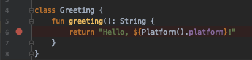
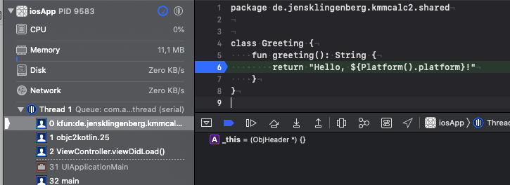

# Debugging
To debug Kotlin Code on iOS, you have the following two options:

## Android Studio
1) Make you sure you have installed the [KMM Plugin](/multiplatform/kmmplugin)

2) Add a breakpoint to your Kotlin Code, inside the common module or your iOS module.

  

Click right of the number line, a red dot will appear.

3) Run your App, in debug mode

  

In the toolbar above, select the **iosApp** Run Configuration and click on the debug button next to play icon

4) When your code is being executed, the debugger will stop inside your Kotlin Code.

  

## Xcode
You can also debug your Kotlin Code inside of Xcode. This is possible with a Xcode plugin developed by Touchlab

1) See the installation instruction from https://github.com/touchlab/xcode-kotlin

2) Add the Kotlin files to your Xcode project and set a breakpoint

  

3) Run your app and use the debugger

  

