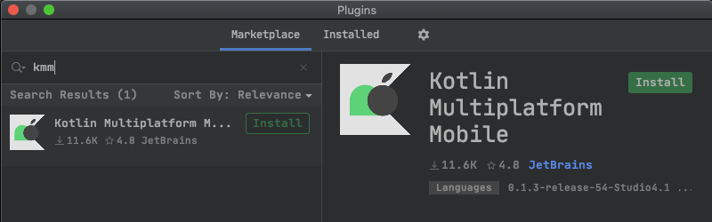

# Kotlin Multiplatform Mobile Plugin

With the KMM Plugin you can debug Kotlin Code on iOS from inside Android Studio.

1) Install Android Studio
https://developer.android.com/studio

2) Install the KMM Plugin
Go to Preferences>Plugins, search for KMM, click install and restart Android Studio

  

